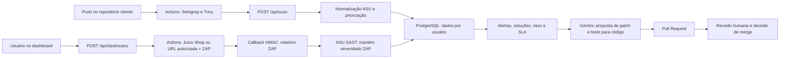
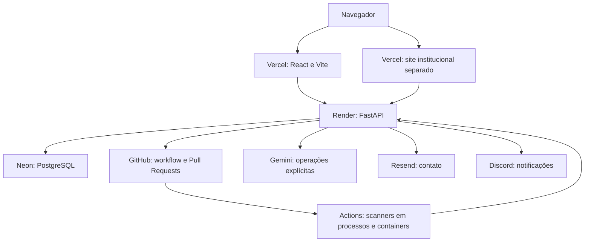

# Apex Security · v3.0.0


**Da detecção à decisão: segurança de aplicações com contexto e revisão humana.**

Apex Security is an open-source Application Security Posture Management platform.
It unifies static and dynamic findings, proposes AI-assisted fixes, and keeps humans in control.


## Acesse ao vivo

| Aplicação | Acesso |
|---|---|
| Dashboard | [apex-security-kappa.vercel.app](https://apex-security-kappa.vercel.app) |
| Documentação da API | [Swagger no Render](https://apex-security-xzk4.onrender.com/docs) |
| Site institucional | [Apresentação da Apex](https://apex-security-site-apresentacao.vercel.app) |
| Código | [muricarlucci/Apex-Security](https://github.com/muricarlucci/Apex-Security) |

O backend gratuito do Render pode dormir após inatividade. A primeira resposta pode levar **30 a 50 segundos**. Abra a [saúde da API](https://apex-security-xzk4.onrender.com/health) antes de uma demonstração. A disponibilização do DAST real exige os secrets descritos em [DEPLOY.md](DEPLOY.md).

## O que é e por que existe

Scanners produzem alertas em formatos diferentes; equipes precisam entender quais importam e como agir. A Apex reúne esses resultados em um formato comum, acrescenta contexto e aproxima detecção, proposta de correção e revisão humana. O objetivo acadêmico é reduzir fadiga de alertas e o atrito entre segurança e desenvolvimento.

As varreduras pesadas ficam no GitHub Actions. A API orquestra, normaliza e apresenta os dados; a IA é usada apenas nas ações analíticas e de remediação existentes.

## Cobertura de análise

| Tipo | Ferramenta | O que analisa | Tratamento pela Apex |
|---|---|---|---|
| SAST | Semgrep | Código-fonte | ASU, priorização contextual, proposta de patch/teste e PR revisável |
| SCA | Trivy | Dependências vulneráveis | ASU, contexto, risco e fluxo de remediação existente |
| IaC / misconfiguração | Trivy | Configurações de infraestrutura | ASU e regras determinísticas explicáveis |
| DAST | OWASP ZAP | Comportamento HTTP da aplicação em execução | ASU, severidade do ZAP, recomendação, risco e SLA |

DAST complementa a análise estática. Seus achados não identificam automaticamente uma linha de código: **Ver solução** mostra a recomendação do ZAP; correlação com código e PR automático para DAST estão no roadmap.

## Avalie em 5 minutos

1. Abra o dashboard. Crie uma conta ou use **Modo Demo** na tela de acesso.
2. Em **Alertas**, explore severidades, ferramentas, tipos de análise e o relatório PDF.
3. Abra **DAST → Laboratório Apex → Passivo rápido → Iniciar análise dinâmica**. Em Demo, o andamento e os resultados são simulados localmente.
4. Abra os alertas ZAP e expanda **Ver solução**. Para um alerta estático, veja as ações de remediação e PR.
5. Explore **Risco Real**, o grafo e **Ver SLA**; são estimativas de apoio à decisão.
6. Em **Radar**, gere o panorama setorial. Em Demo, nenhum Gemini é usado.
7. Troque o idioma na sidebar; existem português, inglês, espanhol, chinês, hindi, francês e japonês.

**DAST real não cabe necessariamente em cinco minutos:** precisa de conta e integração configurada; reserve cerca de **5 a 10 minutos**, sujeitos ao runner, download das imagens, alvo e cold start. Para apresentação rápida, execute antes ou use Demo. Não há promessa de descoberta exaustiva nem de duração fixa.

## Arquitetura

### Fluxo de análise e decisão



### Infraestrutura



## Funcionalidades

| Módulo | Função | Tecnologia / código |
|---|---|---|
| 1. Pipeline CI/CD | Varredura estática fora da API | [GitHub Actions, Semgrep e Trivy](.github/workflows/apex-scan.yml) |
| 2. Normalização ASU | Formato comum para os achados | [Python](backend/services/normalizer.py) |
| 3. Priorização IaC | Severidade contextual explicável para scans estáticos | [Regras determinísticas](backend/services/prioritizer.py) |
| 4. DLP de borda | Ofuscação de segredos no trecho da remediação | [DLP](backend/services/dlp.py) |
| 5. Remediação | Patch e teste obrigatório, com reutilização de resultado válido | [Gemini](backend/services/remediator.py) |
| 6. Pull Request | Branch, commits e PR; nenhuma decisão automática de merge | [PyGithub](backend/services/pr_creator.py) |
| 7. Anomalias | Sinal estatístico consultivo | [Isolation Forest](backend/services/anomaly_detector.py) |
| 8. Intenção | Compara mensagem de commit com diff | [Gemini](backend/services/intent_checker.py) |
| 9. Risco Real e SLA | Estimativas financeiras, blast radius e SLA em ações independentes | [Gemini / FAIR / LGPD](backend/services/risk_analyzer.py) |
| 10. Autenticação | Sessão e isolamento por conta | [JWT, bcrypt e chave de integração](backend/services/auth.py) |
| 11. Radar | Panorama setorial; síntese do modelo, sem busca ao vivo | [Gemini](backend/services/radar.py) |
| 12. DAST | Análise dinâmica com acompanhamento e histórico | [ZAP no Actions](.github/workflows/apex-dast.yml), [API](backend/routes/dast.py) |

Também há notificações Discord, contato Resend, Demo, exportações PDF, Health Score e sete idiomas. A numeração dos módulos aparece somente na documentação.

## DAST em detalhes

- **Laboratório Apex:** Juice Shop em container do próprio job; ZAP alcança `http://localhost:3000` no runner.
- **URL autorizada:** HTTP/HTTPS público, sem credenciais; autorização declarada e registrada por conta.
- Passivo por padrão; ativo apenas no laboratório ou em hosts de treinamento configurados.
- Validação de endereço e DNS na API e no runner; limite de cinco solicitações por conta em 24h, uma ativa por conta e uma execução global do workflow.
- Callback HMAC-SHA256, expiração de 45 minutos, rejeição após estado final, corpo de até 8 MiB e até 20 instâncias armazenadas por alerta.
- Uma transação para todos os alertas e o estado final; uma notificação Discord após commit.
- **Zero Gemini na execução DAST.** Risco/SLA só usam Gemini quando o usuário solicita essas ações existentes.

Veja [arquitetura, variáveis, limitações e troubleshooting](docs/dast.md). A autorização declarada não comprova propriedade; a validação DNS inicial não é um firewall contra rebinding ou redirecionamentos posteriores.

## Segurança e IA responsável

PRs exigem revisão humana. Senhas usam bcrypt, sessões usam JWT e consultas normais filtram por `user_id`. A severidade estática é determinada por regras; DAST preserva o risco do ZAP. Risco, SLA, Radar, Intenção e Anomalias são **consultivos**.

Gemini permanece com `gemini-3.8-flash` principal e as duas chaves. Uma operação normal faz uma request; 503 admite um retry curto, depois uma tentativa única com `gemini-3.5-flash-lite`. Cota diária explicitamente associada ao modelo principal também admite contingência. 429 compartilhado/ambíguo não alterna chaves inutilmente. Cache e deduplicação são separados por usuário; Radar reutiliza até 6h com data original, Intenção/Risco/SLA até 1h e Remediação mantém resultado válido enquanto a entrada não mudar. RPC de 20s, orçamento de 65s, frontend de 120s; cancelamento impede novas tentativas.

**Limites conhecidos:** sem verificação de e-mail, 2FA ou rate limiting global; chave de integração em texto no banco; DLP cobre o trecho da remediação, não todos os campos enviados à IA; ingestão estática sem idempotência plena. Scan sem chave mantém o modo legado, com `user_id=None`; chave enviada mas inválida retorna 401. DAST não autentica sessões do alvo e não correlaciona automaticamente achado com código. O contato é uma integração real; o contrato offline do Demo não cobre o envio do formulário de Contato existente.

## Stack e estrutura

Python 3.11, FastAPI, SQLAlchemy/PostgreSQL, PyGithub, Google Generative AI SDK, scikit-learn, React, Vite, react-i18next, Recharts, React Flow, jsPDF. Ferramentas externas: Semgrep, Trivy, ZAP e Juice Shop.

```text
Apex-Security/
├── backend/
│   ├── main.py              # API e registro de routers
│   ├── database.py          # Pool e migrações aditivas no startup
│   ├── models.py            # Dados existentes + dast_scans
│   ├── routes/              # Endpoints autenticados e callback DAST
│   └── services/            # ASU, regras, Gemini, DAST e integrações
├── frontend/src/            # Dashboard, Demo, páginas e sete idiomas
├── .github/workflows/       # apex-scan.yml e apex-dast.yml
├── pipeline/                # Workflow estático de referência e runner DAST
├── tests/                   # Testes offline com mocks e fixtures
├── scripts/                 # Verificação de cabeçalhos GPL
├── docs/                    # ASU, DAST e diagnóstico histórico
├── LICENSE.md               # Texto oficial integral GPL v3
├── AUTHORS.md               # Autores e contribuidores
└── THIRD_PARTY_NOTICES.md    # Licenças das dependências principais
```

## Conecte um repositório e execute DAST

**SAST/SCA/IaC:** crie conta, copie a chave em **Chave de Integração**, salve no repositório cliente os secrets `APEX_USER_API_KEY` e `APEX_API_URL=https://apex-security-xzk4.onrender.com`. Copie [apex-scan.yml](.github/workflows/apex-scan.yml) para `.github/workflows/` e faça push. A cópia em [pipeline](pipeline/.github/workflows/apex-scan.yml) permanece idêntica. O workflow identifica `github.repository` e envia para `/api/scan`.

**DAST:** configure o mesmo segredo em `APEX_DAST_SECRET` no GitHub da Apex e `DAST_CALLBACK_SECRET` no Render. Confira o PAT `GITHUB_TOKEN`, com `repo` e `workflow`. No dashboard, escolha laboratório/passivo, inicie e acompanhe **Apex DAST Scan** no Actions. Os alertas aparecem na conta que iniciou a análise. Para URL personalizada, declare autorização. Instruções completas em [DEPLOY.md](DEPLOY.md).

## Para desenvolvedores

<details>
<summary>Ambiente local e variáveis</summary>

No PowerShell, use Python **3.11.x** e um banco de desenvolvimento. Iniciar o backend cria tabelas faltantes e aplica migrações aditivas; não aponte acidentalmente para produção.

```powershell
cd "D:\DASHBOARD APEX\Apex-Security\backend"
py -3.11 -m venv .venv
.\.venv\Scripts\Activate.ps1
pip install -r requirements.txt
Copy-Item .env.example .env
# Preencha o .env local, sem versioná-lo.
uvicorn main:app --reload
```

Em outro terminal:

```powershell
cd "D:\DASHBOARD APEX\Apex-Security\frontend"
npm ci
Copy-Item .env.example .env.local
# VITE_API_URL=http://localhost:8000/api em .env.local
npm run dev
```

API local: `http://localhost:8000/docs`; dashboard: `http://localhost:5173`.

| Backend | Uso / padrão |
|---|---|
| `DATABASE_URL` | PostgreSQL de desenvolvimento ou Neon com SSL |
| `GEMINI_API_KEY`, `GEMINI_API_KEY_2` | Duas chaves Gemini, mantidas |
| `GEMINI_MODEL` | `gemini-3.8-flash`; contingência não exige outra variável |
| `GITHUB_TOKEN`, `GITHUB_REPO` | PAT e `muricarlucci/Apex-Security` |
| `JWT_SECRET_KEY` | Assinatura de sessões |
| `RESEND_API_KEY`, `CONTACT_EMAIL_TO`, `RESEND_FROM_ADDRESS` | Contato |
| `FRONTEND_URL`, `SITE_URL` | Origens CORS dos dois frontends |
| `DAST_CALLBACK_SECRET` | Obrigatório para DAST; igual a `APEX_DAST_SECRET` no GitHub |
| `DAST_DAILY_LIMIT` | `5`, por usuário em 24h |
| `DAST_TRAINING_HOSTS` | `testphp.vulnweb.com,demo.testfire.net,public-firing-range.appspot.com` |
| `DAST_ENABLE_ACTIVE` | `true`; use `false` para desabilitar full |
| `DAST_WORKFLOW_FILE`, `DAST_WORKFLOW_REF` | `apex-dast.yml`, `main` |
| `DAST_CALLBACK_TTL_MINUTES` | `45`, desde a solicitação |

Frontend: `VITE_API_URL=https://apex-security-xzk4.onrender.com/api` em produção. Mudanças exigem novo build/redeploy. `APEX_API_URL` é secret do Actions, **não configuração do backend**. As variáveis DAST são definidas no painel do Render; `render.yaml` não recebeu mudanças funcionais.

</details>

<details>
<summary>Testes e verificações offline</summary>

```powershell
cd "D:\DASHBOARD APEX\Apex-Security"
backend\.venv\Scripts\python.exe -m pytest tests -q
backend\.venv\Scripts\python.exe scripts/check_license_headers.py
cd frontend
npm run build
npm run test:i18n
# Requer Playwright instalado; permite pacote preexistente via APEX_PLAYWRIGHT_MODULE.
npm run test:i18n:browser
```

As APIs são simuladas; não execute scanners, servidor ou chamadas reais para validar alterações de código. O `TestClient` roda a aplicação em memória. Os testes isolam o transporte Gemini antes da coleta, evitando geração real e a DLL gRPC bloqueada neste Windows. A validação real do ZAP e das credenciais será feita pelo operador após o deploy.

</details>

## Documentação adicional

- [Deploy e configuração](DEPLOY.md)
- [Contexto atualizado do projeto](CONTEXTO_APEX.md)
- [Schema ASU](docs/asu-schema.md)
- [DAST](docs/dast.md)
- [Histórico de versões](CHANGELOG.md)

## Roadmap

Correlação DAST com código, autenticação de sessão para scanners, proteção de saída contra rebinding/redirecionamentos, fila durável de análises, idempotência de ingestão, verificação de e-mail/2FA, rate limiting global e maior cobertura de DLP nos serviços de IA.

## Licença

**GNU GPL v3 ou posterior**, identificador `GPL-3.0-or-later`. O texto oficial integral está em [LICENSE.md](LICENSE.md). Dependências mantêm suas próprias licenças e avisos em [THIRD_PARTY_NOTICES.md](THIRD_PARTY_NOTICES.md).

Arquivos próprios de código têm cabeçalhos SPDX. **Sem cabeçalho:** JSON (locales, regras, package/lock/vercel), imagens e outros binários, `.gitignore` e `.env.example`, que ficam cobertos pela licença da raiz e pelo campo `license` do pacote. `LICENSE.md` contém somente o texto oficial. `node_modules`, `dist` e `.venv` são artefatos/dependências externos, não recebem cabeçalho Apex nem têm suas licenças substituídas.

## Autores e créditos

**Murilo Carlucci, Guilherme Catto e Miguel Domingos.** Projeto acadêmico de **Cibersegurança — FIAP, 2026**. Histórico de contribuições preservado; veja [AUTHORS.md](AUTHORS.md). Créditos às comunidades das ferramentas e bibliotecas utilizadas.

## Uso autorizado

Execute análises somente em aplicações próprias ou com autorização expressa. O laboratório foi criado para treinamento; o modo ativo envia ataques reais. Resultados de scanners e IA exigem análise humana e não constituem certificação de segurança ou parecer jurídico.
