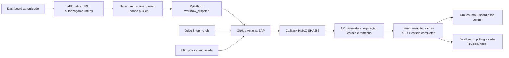

# DAST com OWASP ZAP

DAST testa a aplicação em execução por HTTP. Na v3.0.0, a Apex orquestra **OWASP ZAP**, recebe o relatório traditional-json e incorpora os achados ao ASU. Não usa Gemini para escanear, normalizar ou receber o resultado.

## Arquitetura



ZAP é a ferramenta dinâmica open source escolhida, distribuída sob Apache-2.0. Executa em container no Actions, evitando Java e varredura pesada na memória limitada do Render. Juice Shop executa em processo/container separado no mesmo job.

## Alvos e modos

| Alvo | Passivo / baseline | Ativo / full |
|---|---|---|
| Laboratório Apex | Juice Shop no runner, `http://localhost:3000` | Permitido quando ativo habilitado |
| URL pública autorizada | Permitido com declaração de autorização | Só hostname exato da allowlist |

O laboratório não publica seu serviço na API da Apex. Docker expõe a porta apenas em loopback do runner; ZAP usa `--network host` para alcançá-la. A API não visita o laboratório.

Baseline executa spider e análise passiva; ainda produz tráfego ao alvo. Full também realiza ataques ativos. Ambos habilitam AJAX spider (`-j`) para SPA, usam `-J zap-report.json`, `-I` para não falhar apenas por warnings, `-m 2` para spider e `-T 15` para espera de inicialização/análise passiva. **`-T` não limita sozinho todo o scan full:** o subprocesso tem prazo de 20 minutos e o job de 30 minutos. Falha real, relatório ausente ou JSON inválido não contam como sucesso.

Imagens: `ghcr.io/zaproxy/zaproxy:stable` e `bkimminich/juice-shop`. São tags móveis; updates upstream podem alterar findings e tempo. Reserve cerca de 5–10 minutos para baseline, com variação conforme imagens, runner e alvo. A prontidão do laboratório tem prazo de 3 minutos. A disponibilidade dos sites de treino não é garantida pela Apex.

## Segurança

1. URL custom exige `authorization_ack: true` booleano. Conta e instante de aceitação ficam em `dast_scans`.
2. HTTP/HTTPS, host obrigatório, até 2048 caracteres; sem credenciais, fragmentos, espaços, barras invertidas ou caracteres de shell fora do alfabeto aceito.
3. Rejeição de localhost e sufixos locais/internos. IP literal e **todos** os resultados DNS devem ser globais; privados, reservados, multicast, loopback, link-local, metadata e IPv6 equivalente são rejeitados.
4. Validação repetida no runner antes da varredura. A URL do callback precisa ser uma origem HTTPS pública sem path/query.
5. Limite padrão: cinco solicitações por conta em uma janela móvel de 24h, inclusive as que falharam. Uma análise queued/running por conta; lock da linha do usuário em PostgreSQL serializa esse controle entre processos.
6. Workflow com concorrência global `apex-dast`, sem cancelamento da execução em andamento. A concorrência nativa do Actions **não é uma fila durável ilimitada**: execuções pending podem ser substituídas. Sem retorno, a Apex expira a solicitação.
7. Nonce público aleatório de 32 bytes por análise. O segredo **nunca** vai como input do workflow. HMAC-SHA256 sobre `scan_id:nonce`, header `X-Apex-Dast-Signature`, comparação constante; sem JWT no callback.
8. Expiração padrão 45 minutos desde a solicitação, não desde o início do runner. Assinatura inválida retorna 401; expirado 410; estado final rejeita novo retorno com 409.
9. Corpo de callback limitado a 8 MiB; até 20 instâncias por alerta no JSON armazenado. Nenhum log de assinatura, secret ou corpo do relatório. O scanner não publica o relatório como artifact público.
10. Todos os alertas e o estado final são gravados juntos; falha faz rollback. Discord ocorre uma vez após commit; falha da notificação não desfaz a análise.

O HMAC vincula o callback à análise usando o segredo compartilhado, conforme este protocolo; o corpo não faz parte da mensagem assinada. HTTPS e administradores autorizados do workflow são parte da confiança. Quem administra o repositório e seus secrets pode produzir callbacks. A declaração de autorização não comprova propriedade do alvo.

**Limite anti-SSRF:** checagem inicial/repetida de DNS não fixa a resolução durante toda a execução e não controla todos os redirecionamentos, subrecursos ou DNS rebinding. O runner não deve conter acesso privilegiado a redes internas. Restrição de egress contínua e escopo de navegação mais rígido estão no roadmap.

## API e estados

| Endpoint (prefixo `/api`) | Autenticação | Resposta |
|---|---|---|
| `GET /dast/config` | JWT | Configuração pública, hosts, limite/restante |
| `POST /dast/scans` | JWT | 202 com id, alvo, modo, queued e actions_url |
| `GET /dast/scans` | JWT | Últimas 20 análises da conta |
| `GET /dast/scans/{id}` | JWT | Detalhe da conta; outra conta recebe 404 |
| `POST /dast/scans/{id}/results` | HMAC | running / completed / failed |

Estados: queued → running → completed ou failed; sem retorno no prazo → timeout ao listar/consultar. O dashboard mostra também a etapa visual de processamento; não existe estado persistido `processing`. Ausência de secret/token impede dispatch com 503; solicitação ativa retorna 409; limite diário, 429. Falha no dispatch deixa registro failed e retorna 502.

O callback completed admite até cinco tentativas de entrega (120s por tentativa, 20s entre tentativas), sem refazer o scan. Running/failed têm uma tentativa de melhor esforço. Um commit confirmado no banco seguido de resposta HTTP perdida pode causar 409 no reenvio; a análise já concluída não é duplicada nem sobrescrita.

## Configuração

| Local | Variável | Padrão / valor |
|---|---|---|
| Render | `DAST_CALLBACK_SECRET` | Obrigatória; segredo forte |
| GitHub da Apex | `APEX_DAST_SECRET` | Mesmo segredo do Render |
| GitHub da Apex | `APEX_API_URL` | `https://apex-security-xzk4.onrender.com` |
| Render | `GITHUB_TOKEN`, `GITHUB_REPO` | PAT com repo/workflow; `muricarlucci/Apex-Security` |
| Render | `DAST_DAILY_LIMIT` | `5` |
| Render | `DAST_TRAINING_HOSTS` | `testphp.vulnweb.com,demo.testfire.net,public-firing-range.appspot.com` |
| Render | `DAST_ENABLE_ACTIVE` | `true` |
| Render | `DAST_WORKFLOW_FILE`, `DAST_WORKFLOW_REF` | `apex-dast.yml`, `main` |
| Render | `DAST_CALLBACK_TTL_MINUTES` | `45` |

As variáveis opcionais têm defaults no código; `render.yaml` foi preservado funcionalmente. Hosts de treinamento são enviados como configuração pública ao workflow para alinhar a validação do runner com o Render. Não são segredos. Veja a sequência manual em [DEPLOY.md](../DEPLOY.md).

Inputs do workflow podem ficar visíveis em repositório público, inclusive a URL do alvo. Não coloque tokens ou outros segredos na URL customizada. O secret do callback permanece exclusivamente nos secrets do GitHub/Render.

## Normalização ZAP → ASU

| `riskcode` do ZAP | Severidade ASU |
|---|---|
| `3` | HIGH |
| `2` | MEDIUM |
| `1` | LOW |
| `0` ou desconhecido | INFO |

Não há CRITICAL no ZAP. Há **um alerta ASU por alerta ZAP**, não por instância. `source_tool=zap`, `scan_type=DAST`, `repository=dast:<host>` ou `dast:juice-shop-lab`, URI inicial como `file_path`, sem linha/CVE, CWE separado. HTML de descrição/solução é removido; descrição inclui total de instâncias, até cinco URLs e confiança. `raw_output` preserva os demais campos e até 20 instâncias.

**DAST não chama `prioritize()`.** Regras estáticas que casam `test` no caminho poderiam rebaixar `testphp.vulnweb.com` indevidamente. Portanto `severity_adjusted == severity` para DAST; nenhum mecanismo estático foi modificado.

O fixture [zap-traditional.json](../tests/fixtures/zap-traditional.json) segue o relatório publicado na [documentação oficial traditional-json](https://www.zaproxy.org/docs/desktop/addons/report-generation/report-traditional-json/), com alvo/evidências adaptados para testes offline. Não é resultado de scan executado nesta entrega.

## Pipeline próprio

O workflow integrado deve permanecer no repositório configurado por `GITHUB_REPO`: a API cria o registro/nonce e faz o dispatch. Copiar apenas o YAML para um cliente exige também copiar `pipeline/dast_job.py` e os dois módulos stdlib `dast_config.py`/`dast_validator.py`, configurar os secrets e apontar `GITHUB_REPO` para esse repositório. Não digite IDs/nonces fictícios: inicie pelo dashboard.

Para um scan independente, sem enviar para a Apex, em um runner Linux com alvo autorizado:

```bash
mkdir -p zap-wrk
chmod 777 zap-wrk
docker run --rm --network host -v "$PWD/zap-wrk:/zap/wrk/:rw" \
  ghcr.io/zaproxy/zaproxy:stable zap-baseline.py \
  -t "$AUTHORIZED_TARGET_URL" -J zap-report.json -I -j -m 2 -T 15 -s
```

Defina/valide `AUTHORIZED_TARGET_URL` antes. Essa execução independente **não** importa resultados na Apex. Para full, apenas laboratório/alvo de treinamento explicitamente autorizado e política equivalente à allowlist da integração.

## Limitações e troubleshooting

- Sem sessão autenticada do alvo: páginas privadas e fluxos pós-login podem ficar fora da cobertura.
- Spider de duração curta e baseline não garantem descoberta de XSS/SQLi. Esses exemplos em Demo são fictícios; não prometa os mesmos achados em baseline.
- Não há correlação automática com código, patch ou PR DAST; solução, Risco e SLA continuam disponíveis.
- **503/configuração pendente:** salve `DAST_CALLBACK_SECRET` no Render e confira `GITHUB_TOKEN`; no GitHub, configure `APEX_DAST_SECRET` igual.
- **502/token:** confira validade do PAT e escopos repo/workflow. **Workflow inexistente:** confira publicação na main, nome/ref e `GITHUB_REPO`.
- **401 callback:** os dois secrets divergem, ou ID/nonce não correspondem. Não publique assinaturas para diagnosticar.
- **409:** já existe análise ativa, ou o callback chegou após estado final. Confira o histórico antes de repetir.
- **429:** limite DAST da conta em 24h; não é cota Gemini. Aguarde a janela ou altere a política conscientemente.
- **Timeout:** fila global, minutos Actions, download de imagens, alvo indisponível ou entrega do callback. Consulte o workflow; não reenvie retorno expirado.
- **ZAP falhou:** código de saída, relatório ausente/inválido ou prazo excedido. Nenhum resultado falso é importado; o job tenta sinalizar failed.
- **Completed com erro no Actions:** o resultado pode ter sido gravado antes de uma resposta HTTP perdida; callback de replay retorna 409. Confirme o histórico/alertas.
- Repositórios privados podem consumir minutos do plano Actions. Rotacionar o segredo durante uma análise invalida seu callback.

## Referências oficiais

[ZAP baseline](https://www.zaproxy.org/docs/docker/baseline-scan/), [ZAP full](https://www.zaproxy.org/docs/docker/full-scan/), [JSON tradicional](https://www.zaproxy.org/docs/desktop/addons/report-generation/report-traditional-json/), [Juice Shop em Docker](https://help.owasp-juice.shop/part1/running.html).
